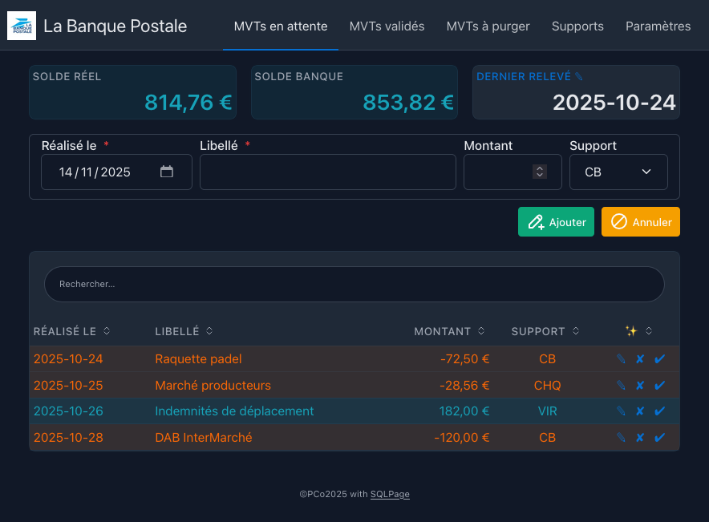

# Rapprochement bancaire

> Visualisation des soldes réel et bancaire




## Installation

- nécessite
  - `sqlite` 🌐 https://www.sqlite.org/download.html
  - `Sqlpage` 🌐 https://github.com/sqlpage/SQLPage#get-started

- télécharger l'archive compressée et la décompresser
- lancer le fichier de commande correspondant à votre système

## Fonctionnalités

1. saisir les mouvements réalisés `(date, libellé, montant, support)`
2. valider les mouvements lors de la réception d'un relevé bancaire
3. purger (éventuellement) les mouvements anciens !

## Localisation

<details>
<summary>Devise<br/>📌 La configuration de base est l'euro (EUR - €)
</summary>

### 2 fonctions utilisées :
  - `format` pour formater un réel en une valeur monétaire (au format US !)
  - double `replace` pour la représentation locale (séparateur de milliers et séparateur décimal)

| devise | formule | résultat |
| ------ | ------- | -------- |
| USD*    | `replace(replace(format('$ %,.2f', 1234.5), ',', ','), '.', '.')` | $ 1,234.50| 
| EUR    | `replace(replace(format('%,.2f €', 1234.5), ',', ' '), '.', ',')` | 1 234,50 € |
| CHF    | `replace(replace(format('%,.2f CHF', 1234.5), ',', [']), '.', ',')` | 1'234,50 CHF |

\* formule simplifiée pour le format «*US*» = `format('$ %,.2f', 1234.5)`

⮑ Modifier les fichiers suivants en remplaçant les ❓ par les valeurs adéquates :

🗄 `sqlpage/migrations/003_create_mvts.sql`
```sql
⋮
CREATE TABLE mvts (
    id         INTEGER      PRIMARY KEY,
    ⋮
    money      "[TEXT ] "   GENERATED ALWAYS AS (replace(replace(format('❓', amount), ',', '❓'), '.', '❓') ) STORED);
```

🗄 `sqlpage/migrations/004_create_all_views.sql`
```sql
⋮
-- Vue : balance_actual
⋮
SELECT replace(replace(format('❓', total), ',', '❓'), '.', '❓') AS money
⋮
-- Vue : balance_bank
⋮
SELECT replace(replace(format('❓', total), ',', '❓'), '.', '❓') AS money
⋮
```

⮑ supprimer le fichier 🗄 `sqlpage/sqlpage.db` et relancer **sqlpage**
</details>

<br>

<details>
<summary>Interface utilisateur<br/>📌 La configuration de base est le français
</summary>

Les textes pour l'interface sont stockés dans le fichier
🗄 ***`text.json`***.  

```json
{
  "language": "fr-FR",
  "app_title": "La Banque Postale",
  "action": "✨",
  "search": "Rechercher",
  "no_data": "Aucune donnée !",
  "mvt": {
    "performed": "Réalisé le",
    "label": "Libellé",
    "amount": "Montant",
    "support": "Support",
    "validated": "Validé le",
  ⋮
}
```
⮑ Faites votre propre traduction.

🗄 *`assets/bank.ico`*  
⮑ Modifier l'icône pour l'onglet du navigateur (*favicon*).

🗄 *`assets/bank.jpg`*  
⮑ Modifier l'image à afficher à côté du nom de la banque

</details>

©PCo-2025